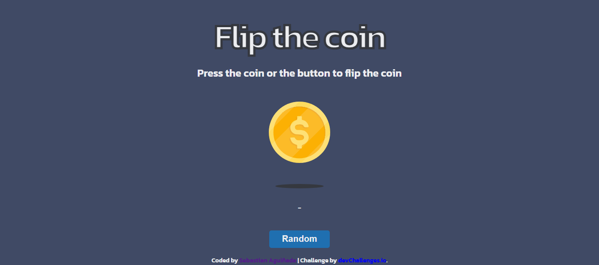

<h1 align="center">Heads or Tails | Coin Flip Simulator</h1>

   Solution for a challenge <a href="https://devchallenges.io/challenge/flip-the-coin" target="_blank">Flip The Coin</a> from <a href="http://devchallenges.io" target="_blank">devChallenges.io</a>.

  <h3>
    <a href="https://coin-flipping-simulator.netlify.app/">
      Demo
    </a>
     | 
    <a href="https://github.com/Sebascode20/coin-flip-simulator">
      Solution
    </a>
     | 
    <a href="https://devchallenges.io/challenge/flip-the-coin">
      Challenge
    </a>
  </h3>

<!-- TABLE OF CONTENTS -->

## Table of Contents

- [Overview](#overview)
  - [What I learned](#what-i-learned)
- [Built with](#built-with)

<!-- OVERVIEW -->

## Overview

### What I learned

-Building interactive user interfaces with vanilla JavaScript.
-Manipulating the DOM to update content dynamically based on user actions.
-Implementing randomization logic using JavaScript to simulate coin toss outcomes.
-Creating smooth CSS animations and 3D visual effects.
-Applying responsive design principles to ensure the application works across different screen sizes.
-Organizing code into separate HTML, CSS, and JavaScript files to improve maintainability and readability.

### Built with

- Semantic HTML5 markup
- CSS custom properties
- Flexbox
- JavaScript (ES6)

## Author

- GitHub [@Sebascode20](https://github.com/Sebascode20)
